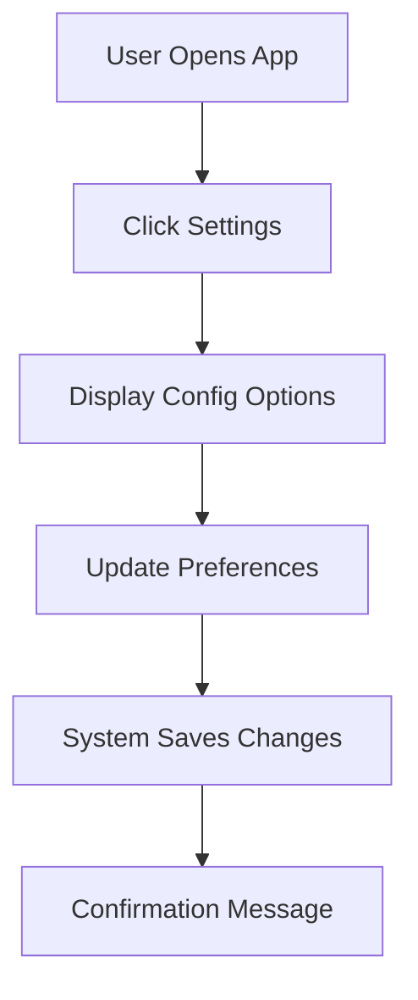
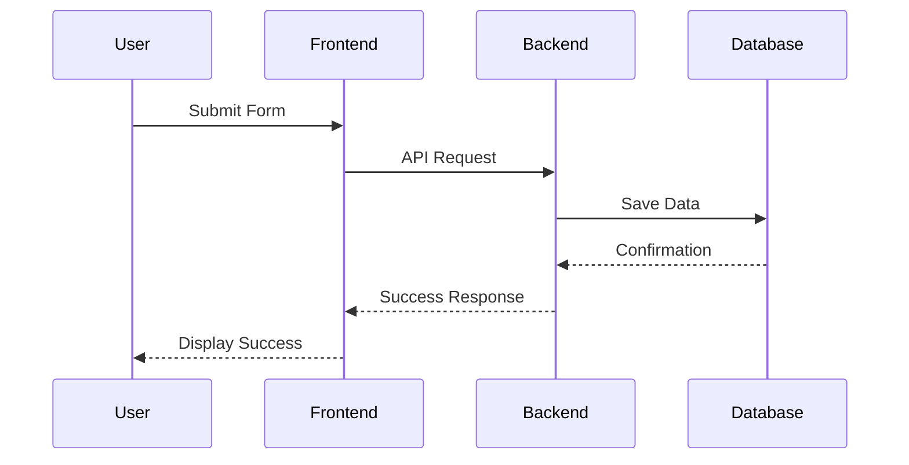
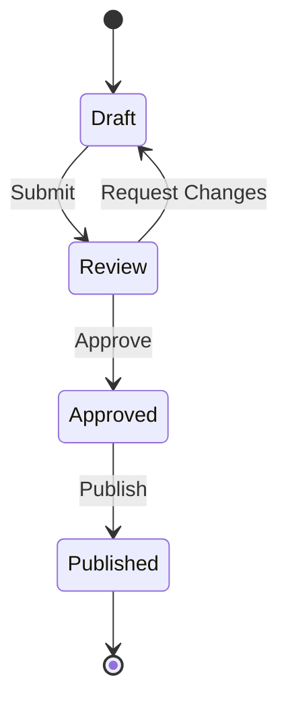

# Issue Templates

This repository contains organization-wide issue templates for the marmoos-project organization.

## Available Templates

### 🎯 User Story
**Purpose**: Create detailed user stories with optional mermaid workflow diagrams

**Key Features**:
- Structured format: "As a [user], I want [goal], so that [benefit]"
- Acceptance criteria checklist
- Workflow description with optional mermaid diagram support
- Priority and story point estimation
- Helpful tips for generating workflow visualizations

**Use When**: You need to capture user requirements and their desired workflows

---

### 💡 Feature Request
**Purpose**: Suggest new features or enhancements

**Key Features**:
- Problem statement and proposed solution
- Alternative solutions considered
- Use cases and expected benefits
- Priority level
- Option to indicate willingness to contribute

**Use When**: You have an idea for improving the product or adding new capabilities

---

### 🐛 User Report
**Purpose**: Report bugs, issues, or problems encountered

**Key Features**:
- Detailed issue description
- Steps to reproduce
- Expected vs actual behavior
- Severity and frequency assessment
- Environment information
- Error messages and logs
- Screenshots/videos support

**Use When**: You've encountered a bug or issue that needs to be fixed

---

### 📊 Executive Level Long Running Task
**Purpose**: Track strategic initiatives and long-term projects

**Key Features**:
- Executive summary and business objectives
- Scope definition (in/out of scope)
- Stakeholder identification
- Timeline with milestones
- Budget and resource allocation
- Success criteria and KPIs
- Risk and dependency tracking
- Regular status update framework

**Use When**: You're initiating a strategic, long-term project that requires executive oversight and regular tracking

---

## Using These Templates

### For Repository Maintainers
These templates are automatically available across all repositories in the marmoos-project organization. When users create a new issue in any repository, they'll be presented with these template options.

### For Contributors
1. Navigate to any repository in the marmoos-project organization
2. Click on "Issues" tab
3. Click "New Issue"
4. Select the appropriate template
5. Fill out the form with as much detail as possible

## Mermaid Workflow Diagrams

The User Story template includes support for mermaid diagrams. Here are some examples:

### Flowchart Example

### Sequence Diagram Example

### State Diagram Example

## Customization

Each template can be customized by editing the corresponding `.yml` file in the `.github/ISSUE_TEMPLATE/` directory.

For more information about GitHub issue templates, see the [GitHub documentation](https://docs.github.com/en/communities/using-templates-to-encourage-useful-issues-and-pull-requests/configuring-issue-templates-for-your-repository).

## Template Structure

All templates follow GitHub's issue form schema with the following structure:
- `name`: Display name of the template
- `description`: Brief description shown in the template chooser
- `title`: Default title prefix for issues created with this template
- `labels`: Automatically applied labels
- `body`: Form fields and structure

## Contributing

To suggest improvements to these templates, please open an issue or submit a pull request to this repository.
